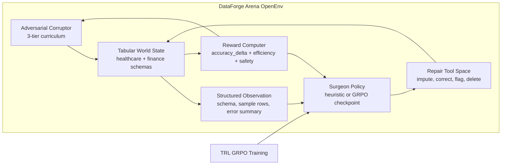

# DataForge Arena

> **An OpenEnv benchmark for training and auditing data-repair agents under adversarial tabular corruption.**

Built for the Meta x PyTorch x Hugging Face x Scaler OpenEnv Hackathon 2026

Theme: World Modeling - Multi-App RL Environment for Enterprise Workflows

[](https://pytorch.org/)
[](https://github.com/huggingface/openenv)
[](https://huggingface.co/docs/trl/main/en/grpo)
[](./tests/test_all.py)
[](./eval/results.json)

---

## The 60-Second Judge Brief

Enterprise agents do not fail only because they cannot write text. They fail because the world state is messy, tools have side effects, and every action should be judged by measurable state improvement.

DataForge Arena turns that reality into a compact RL environment:

- **OpenEnv-compatible world:** a data table, schema, corruption state, valid tool actions, and reward-bearing transitions.
- **Adversarial curriculum:** corruption escalates across tiers as the agent improves.
- **Grounded reward:** the main signal is `accuracy_delta`, not style, fluency, or self-reported confidence.
- **GRPO-ready training stack:** TRL GRPO trains a surgeon policy over structured JSON repair actions.
- **Evidence-first demo:** the UI shows execution provenance, action traces, reward, and before/after dataset health.

## What This Repo Proves Today

This public repo is intentionally honest about evidence. It ships a working environment, a guarded live-model path, and committed artifacts that can be inspected without trusting a slide.

| Claim | Current evidence | Source |
|------|------------------|--------|
| OpenEnv-compatible environment and API | `reset`, `step`, `/health`, `/info`, `/docs` | [`environment/`](./environment), [`environment/server.py`](./environment/server.py) |
| Judge-facing demo with session isolation | Gradio `gr.State()` per session and guarded model loading | [`demo/app.py`](./demo/app.py) |
| Heuristic surgeon beats random on baseline eval | `+0.53 pp` advantage in accuracy delta | [`eval/heuristic_results.json`](./eval/heuristic_results.json) |
| Trained GRPO checkpoint is less destructive than random | `+0.41 pp` advantage in accuracy delta | [`eval/results.json`](./eval/results.json) |
| T4 GRPO proof run completed | Tesla T4, target `80` steps, last logged step `75` | [`logs/training_log.csv`](./logs/training_log.csv), [`logs/training_curve.png`](./logs/training_curve.png) |
| Parser improved during the short run | parse success `25% -> 50%`, mean `40.00%` | [`logs/training_log.csv`](./logs/training_log.csv) |
| Regression suite is green | `60 passed` | `python -m pytest -q` |

Important: the trained checkpoint directory itself is not committed because `outputs/` is intentionally ignored. The committed GRPO evidence comes from the Colab-produced checkpoint at `outputs/dataforge-surgeon`; the demo exposes `Live GRPO Model` only when that checkpoint exists locally.

## Final Colab Evidence

These values come from the final Tesla T4 Colab run and should be treated as evidence, not marketing numbers.

| Artifact | Value |
|----------|-------|
| GPU | Tesla T4 |
| Training target / final logged step | `80` target steps / last logged step `75` |
| First -> final logged reward | `-1.4000 -> -1.4000` |
| Best logged reward | `-0.2000` |
| Smoothed reward, first 3 rows -> last 3 rows | `-1.2000 -> -1.0000` |
| Parse success, first -> final | `25% -> 50%` |
| Mean parse success | `40.00%` |
| GRPO surgeon avg accuracy delta | `-0.0004` |
| Random avg accuracy delta | `-0.0045` |
| GRPO advantage over random | `+0.0041` (`+0.41 pp`) |

## Evidence Snapshot

| Metric | Current value |
|--------|---------------|
| Evaluation mode | `grpo` |
| GRPO avg accuracy delta | `-0.0004` |
| Random avg accuracy delta | `-0.0045` |
| GRPO advantage accuracy delta | `+0.0041` (`+0.41 pp`) |
| GRPO win rate | `0.00%` |
| Random win rate | `0.00%` |
| Eval seed / tier / episodes | `seed=7`, `tier=1`, `episodes=20` |
| Heuristic baseline advantage | `+0.0053` (`+0.53 pp`) |
| Logged parse success mean | `40.00%` |
| Difficulty tiers observed | `1, 2, 3` |

## Why This Is World Modeling

The agent is not answering a prompt in isolation. It is acting inside a structured world:

- Rows have schema, types, missingness, consistency constraints, and duplicate semantics.
- Tools change the world state and can help or harm depending on context.
- The reward computer measures whether the state improved after each action.
- The corruptor shifts the distribution of failures through an adversarial curriculum.

The loop is the benchmark: observe state, predict tool effects, act, receive grounded feedback, and adapt.

## Architecture



## Demo Modes

The Gradio demo in [`demo/app.py`](./demo/app.py) has three execution paths:

- `Naive Baseline`: always available, intentionally weak.
- `Heuristic Surgeon`: always available, matches the committed evidence artifact.
- `Live GRPO Model`: appears only when `outputs/dataforge-surgeon` exists locally.

That checkpoint gate is deliberate. The interface never pretends a live trained model is running when it is not.

## Quick Start

```bash
git clone https://github.com/vivekyarra/dataforge-arena.git
cd dataforge-arena
pip install -r requirements.txt

# Optional: regenerate clean synthetic datasets
python training/generate_data.py

# Verify the environment and contracts
python -m pytest -q

# Reproduce the committed heuristic baseline evidence
python eval/evaluate.py --agent-mode heuristic --episodes 20 --tier 1 --steps 5 --seed 7

# Launch the judge-facing demo
python demo/app.py
```

For Colab GPU training, use [`DataForge_Arena_Colab.ipynb`](./DataForge_Arena_Colab.ipynb). Its setup cell pins the stack that already completed a real Tesla T4 run for this project: `torch==2.10.0+cu128`, `trl==0.24.0`, `unsloth==2026.4.8`, `peft>=0.14.0`, plus the minimal training dependencies, then imports `GRPOTrainer` as a preflight check before training begins.

After training and saving a checkpoint to `outputs/dataforge-surgeon`:

```bash
python eval/evaluate.py --agent-mode grpo --model-path outputs/dataforge-surgeon
python demo/app.py
```

## OpenEnv API

The FastAPI server in [`environment/server.py`](./environment/server.py) exposes:

```text
GET  /health
GET  /info
POST /reset
POST /step
GET  /docs
```

Core environment contract:

```python
class DataForgeEnv(BaseEnv):
    def reset(self) -> DataForgeObservation:
        ...

    def step(self, action: SurgeonAction) -> tuple[DataForgeObservation, float, bool, dict]:
        ...
```

## Repository Map

- [`environment/`](./environment): OpenEnv environment, corruptor, reward logic, tools, schemas, and API server
- [`training/`](./training): GRPO training loop, prompt construction, parser hardening, model selection, and logging
- [`eval/`](./eval): heuristic vs GRPO evaluation harness and committed evidence artifact
- [`demo/`](./demo): judge-facing Gradio demo with provenance-aware execution modes
- [`logs/training_curve.png`](./logs/training_curve.png): final Colab reward curve artifact
- [`tests/`](./tests): regression tests for parser, corruptor, environment, validation, and evidence boundaries
- [`DataForge_Arena_Colab.ipynb`](./DataForge_Arena_Colab.ipynb): notebook path for final training and artifact export
- [`pitch_script.md`](./pitch_script.md): three-minute judge narration with a demo moment
- [`final_submission_summary.md`](./final_submission_summary.md): concise final evidence and pitch positioning

## Links

| Resource | URL |
|----------|-----|
| Live HF Space | https://huggingface.co/spaces/Vivek567/enterprise-data-cleaning-env |
| Colab Notebook | [`DataForge_Arena_Colab.ipynb`](./DataForge_Arena_Colab.ipynb) |
| Judge Pitch Script | [`pitch_script.md`](./pitch_script.md) |
| HF Blog Post | https://huggingface.co/blog/Vivek567/dataforge-arena |
| GitHub | https://github.com/vivekyarra/dataforge-arena |

Built for the [Meta PyTorch OpenEnv AI Hackathon 2026](https://pytorch.org/event/openenv-ai-hackathon/)

MIT License
