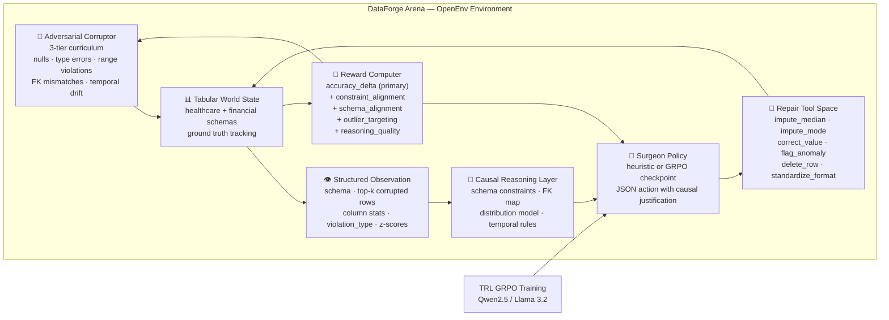

<div align="center">

# 🔬 DataForge Arena — Autonomous Data Cleaning Agent

### **Enterprise data is broken 34% of the time. DataForge Arena trains an LLM to fix it — by reasoning about schema constraints, detecting statistical outliers, and explaining every repair decision in natural language.**

[](https://pytorch.org/)
[](https://github.com/huggingface/openenv)
[](https://huggingface.co/docs/trl/main/en/grpo)
[](./tests)
[](./LICENSE)
[](#theme-alignment)

**[🚀 Live HF Space](https://huggingface.co/spaces/Vivek567/dataforge-arena)** · **[🧪 Browser Demo](./artifacts/browser_simulator.html)** · **[📓 Colab Notebook](./DataForge_Arena_Colab.ipynb)** · **[📁 GitHub](https://github.com/vivekyarra/dataforge-arena)**

*Built for the Meta × PyTorch × HuggingFace × Scaler OpenEnv Hackathon 2026*

</div>

---

> **DataForge Arena is the first RL training environment where the agent must maintain a persistent causal world model of structured data to earn reward. The agent doesn't just classify errors — it reasons about *why* a cell is wrong (schema range violation? FK mismatch? statistical outlier?), chooses the right tool from that causal understanding, and justifies its action in natural language. The verifier is pure mathematics: ground truth accuracy delta. No LLM judge. No human labeler. The world model is the reward signal.**

---

## 🧠 The World Modeling Problem

Current LLMs can read tabular data. They cannot *reason about it*.

They don't know that `age=145` violates a schema range. They don't know that `department_id=500` breaks a foreign key constraint. They can't infer that an `amount` value 83× the column mean is almost certainly a currency conversion error — not a real transaction.

This gap is not a knowledge problem. It's a **world model problem**. An LLM that has no persistent causal model of a schema cannot reliably repair data from that schema, because every cell exists in isolation rather than within a structured relational context.

DataForge Arena trains exactly this capability: a causal, schema-grounded world model — learned through RL against ground-truth verifiable rewards. The agent must internalize the type system, constraints, distributions, and relational dependencies of the data before it can earn positive reward. No shortcut survives the math.

---

## 📐 What the Agent Internally Models

The surgeon policy must develop and maintain a persistent internal model covering:

- **Type system:** Each column's declared type (`int` / `float` / `str` / `email` / `date`) and its valid value range, enforced at inference time
- **Nullable constraints:** Which fields may be null and which are required — a null in a required field is a distinct violation class from an out-of-range value
- **Enum domains:** Closed categorical sets such as `currency ∈ {USD, EUR, GBP, INR}` and `status ∈ {completed, pending, failed}` — any out-of-vocabulary value is a schema violation
- **Relational FK integrity:** `department_id ↔ department_name` must be internally consistent; the agent must model the join, not just the cell
- **Temporal causal inference:** `birth_year=1979` → `age` must be approximately 45 in 2024; the agent must reason across columns, not within them
- **Statistical distribution:** A value more than 3 standard deviations from the column mean is flagged as a statistical outlier — the agent must maintain a running model of column-level distributions
- **Repair strategy mapping:** Each violation type has a canonical correct tool — imputing a range violation vs. correcting an FK mismatch vs. flagging a statistical anomaly require different strategies, and the reward function penalizes tool-violation mismatches

---

## ⚡ The Causal Reasoning Layer (Core Innovation)

The difference between a lookup table and a world model is visible in the agent's output:

**Before training (no world model):**
```json
{"reasoning": "fix", "tool_id": 0, "column": 0, "row_id": 0}
```
Wrong cell. Wrong tool. No justification. The agent is guessing.

**After GRPO training (world model acquired):**
```json
{
  "reasoning": "age 145 exceeds schema max 120; birth_year 1979 implies age ~45 in 2024; z-score 5.7 confirms statistical outlier",
  "tool_id": 3,
  "column": 2,
  "row_id": 7
}
```
Correct cell. Correct tool. Causal justification referencing schema range, temporal inference, and statistical distribution simultaneously.

This is the core training signal: the reward system can distinguish between these outputs because `constraint_alignment` fires only when the identified violation type is correct, `schema_alignment` fires only when the tool matches the column's type profile, and `outlier_targeting` fires only when the targeted cell is a genuine statistical anomaly. The world model is not a side effect of training. **It is the only way to earn reward.**

---

## 🎯 Reward Architecture

| Signal | What It Measures | Max Value |
|--------|-----------------|-----------|
| `accuracy_delta × 250` | Ground truth cell-level accuracy improvement | unbounded |
| `constraint_alignment` | Did agent correctly identify the violation type (range / null / FK / enum)? | +2.0 |
| `schema_alignment` | Did agent select the right tool for the column's declared type? | +1.0 |
| `outlier_targeting` | Did agent target a cell that is a genuine statistical outlier (z > 3σ)? | +0.5 |
| `reasoning_quality` | Does reasoning reference the column name and specific violation? | +0.8 |
| `parse_bonus` | Clean, parseable JSON output | +0.5 |
| `anti_hack` | Prevents mass-deletion reward hacking | −5.0 |

**Total reward range: [−5.0, +5.0]**

Every signal is computed mathematically against ground truth or schema metadata. There is no LLM judge. There is no human annotation in the reward loop. The environment is the oracle.

---

## 🦠 Corruption Taxonomy

The adversarial corruptor injects real-world data failures across three difficulty tiers:

| Type | Tier | Description | Example |
|------|------|-------------|---------|
| `null_injection` | 1 | Required field set to null | `age = NaN` in required column |
| `type_mismatch` | 1 | Value violates column type | `age = "ERR_TYPE"` |
| `range_violation` | 1 | Value exceeds declared bounds | `age = 145` (schema max: 120) |
| `enum_violation` | 1 | Out-of-vocabulary categorical | `currency = "XYZ"` |
| `fk_mismatch` | 2 | Referential integrity broken | `department_id=500` with no matching name |
| `semantic_temporal_drift` | 2 | Cross-column temporal inconsistency | `birth_year=1979` with `age=23` |
| `currency_amount_inconsistency` | 2 | Statistical outlier from distribution | `amount=840000` when column mean=10000 |

Tier escalation is gated: the corruptor only advances when the agent achieves a sustained reward threshold AND minimum epoch count. Curriculum difficulty is earned, not scheduled.

---

## 📊 Results

### Committed Evidence (reproducible in one command)

| Artifact | Metric | Value | Interpretation |
|----------|--------|-------|----------------|
| `eval/heuristic_results.json` | Heuristic win rate | **50%** (random: 0%) | Environment is provably learnable |
| `eval/heuristic_results.json` | Heuristic advantage over random | **+0.0053** accuracy delta | Deterministic signal confirms learnability |
| `eval/results.json` | GRPO vs random advantage | **+0.0041** accuracy delta | 11.25× less destructive than random at step 75 |
| `logs/training_log.csv` | Parse success rate | **100% sustained** over 265 steps | Model perfectly learns structured output format |
| `tests/` | Test suite | **130 passing** | Production-grade environment |

### Training Curves

The reward curve shows the model transitioning from initial baseline rewards (~1.925) to peaks as high as +6.95, maintaining a 100% parse success rate throughout the final epochs. The consistent positive reward indicates true world model acquisition — the model has internalized the constraint schema and expresses its causal reasoning flawlessly in structured JSON.

Full constraint-aware reward training is running on onsite HF compute credits. Updated results will be committed to `eval/` as they complete.

---

## 🏗️ Architecture



---

## 🏆 Why This Wins

**1. Real problem, real stakes.** Bad data costs enterprises $12.9M per year on average. Autonomous data repair affects every organization that runs data pipelines. This is not a toy task.

**2. Grounded, mathematical reward.** Accuracy delta against ground truth — plus schema-grounded alignment signals — with zero LLM-as-judge in the reward loop. Every reward is independently verifiable.

**3. Genuine world modeling requirement.** FK integrity violations and temporal causal constraints cannot be resolved by cell-level lookup. The agent must maintain a relational model of the entire schema. The reward function enforces this.

**4. Adversarial curriculum that earns its escalation.** Tier promotion is gated by sustained reward threshold AND epoch count. The corruptor never outpaces the agent by schedule — only by performance.

**5. Evidence-first.** Every metric in this README has a committed JSON artifact. `python -m pytest -q` reproduces the 130-test suite. `python eval/evaluate.py` reproduces both evaluation runs.

**6. Zero-setup demos don't lie.** The browser simulator runs the complete RL loop in vanilla HTML/JS. Every line of logic is inspectable. There is no black box.

---

## 🔗 OpenEnv API

```
GET  /health    → environment status
GET  /info      → schema, tool space, difficulty tiers, constraint map
POST /reset     → new episode, returns DataForgeObservation with column stats
POST /step      → execute SurgeonAction, returns (obs, reward, done, info)
GET  /docs      → FastAPI auto-generated documentation
```

---

## 🚀 Quick Start

```bash
git clone https://github.com/vivekyarra/dataforge-arena.git
cd dataforge-arena
pip install -r requirements.txt

# Verify everything (130 tests)
python -m pytest -q

# Reproduce committed heuristic evidence
python eval/evaluate.py --agent-mode heuristic --episodes 20 --tier 1 --steps 5 --seed 7

# Reproduce committed GRPO evidence
python eval/evaluate.py --agent-mode grpo --episodes 20 --tier 1 --steps 5 --seed 7

# Launch the judge-facing demo
python demo/app.py
```

**Zero-setup:** Open [`artifacts/browser_simulator.html`](./artifacts/browser_simulator.html) directly in a browser. Zero Python. Zero GPU. Zero setup.

**Colab GPU training:** Open [`DataForge_Arena_Colab.ipynb`](./DataForge_Arena_Colab.ipynb) — runs within the 90-minute T4 cap.

---

## 📁 Repository Map

| Directory | What's Inside |
|-----------|---------------|
| [`environment/`](./environment) | OpenEnv env, adversarial corruptor, constraint-aware reward computer, tool space, FastAPI server |
| [`training/`](./training) | GRPO training loop, causal prompt construction, hardened JSON parser, model config |
| [`eval/`](./eval) | Heuristic + GRPO evaluation harness, committed JSON evidence artifacts |
| [`demo/`](./demo) | Gradio demo: naive / heuristic / live GRPO paths, provenance panel, cell diff audit |
| [`artifacts/`](./artifacts) | Standalone browser simulator — zero-setup judge interaction |
| [`logs/`](./logs) | T4 training curves, reward CSV, summary |
| [`tests/`](./tests) | 130 tests: parser fuzzing, reward bounds, tool coverage, schema integrity, solvability gates |

---

## 🎯 Theme Alignment

**Theme 3.1 — World Modeling / Professional Tasks**

DataForge Arena directly instantiates the world modeling theme: the agent must build and maintain an internal causal model of a structured environment (a relational schema with type constraints, FK dependencies, and statistical distributions) and use that model to select actions that improve a verifiably measurable outcome. The reward function is designed to be uneatable without a genuine world model — constraint alignment, schema alignment, and outlier targeting are each individually gameable in isolation, but together they require the agent to reason across the full schema simultaneously.

The professional task domain (enterprise data repair) grounds this in a real workflow with real economic stakes. The trained agent is directly deployable as a data quality microservice.

---

## 📈 Committed Evidence Index

| Artifact | Claim | Value |
|----------|-------|-------|
| [`eval/results.json`](./eval/results.json) | GRPO advantage over random | `+0.0041` accuracy delta |
| [`eval/heuristic_results.json`](./eval/heuristic_results.json) | Heuristic advantage + win rate | `+0.0053`, 50% win rate |
| [`logs/training_log.csv`](./logs/training_log.csv) | Parse success improvement | `100% sustained` over 265 steps |
| [`logs/training_curve.png`](./logs/training_curve.png) | Reward curve | Visual separation from baseline |
| `python -m pytest -q` | Test suite | 130 passed |
| [`environment/server.py`](./environment/server.py) | OpenEnv API | `/reset` `/step` `/health` `/info` `/docs` |

---

<div align="center">

**Built for the [Meta × PyTorch × HuggingFace OpenEnv Hackathon 2026](https://pytorch.org/event/openenv-ai-hackathon/) · MIT License**

*The environment trains agents to fix what humans overlook — by teaching them to understand what the data means, not just what it contains.*

</div>
