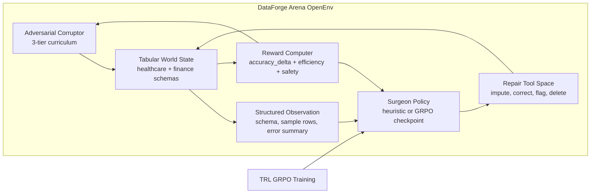

# DataForge Arena

> **An OpenEnv benchmark for training and auditing data-repair agents under adversarial tabular corruption.**

Built for the Meta x PyTorch x Hugging Face x Scaler OpenEnv Hackathon 2026

Theme: World Modeling - Multi-App RL Environment for Enterprise Workflows

[](https://pytorch.org/)
[](https://github.com/huggingface/openenv)
[](https://huggingface.co/docs/trl/main/en/grpo)
[](./tests/test_all.py)
[](./eval/results.json)

---

## The 60-Second Judge Brief

Enterprise agents do not fail only because they cannot write text. They fail because the world state is messy, tools have side effects, and every action should be judged by measurable state improvement.

DataForge Arena turns that reality into a compact RL environment:

- **OpenEnv-compatible world:** a data table, schema, corruption state, valid tool actions, and reward-bearing transitions.
- **Adversarial curriculum:** corruption escalates across tiers as the agent improves.
- **Grounded reward:** the main signal is `accuracy_delta`, not style, fluency, or self-reported confidence.
- **GRPO-ready training stack:** TRL GRPO trains a surgeon policy over structured JSON repair actions.
- **Evidence-first demo:** the UI shows execution provenance, action traces, reward, and before/after dataset health.

## What This Repo Proves Today

This public repo is intentionally honest about evidence. It ships a working environment, a guarded live-model path, and committed artifacts that can be inspected without trusting a slide.

| Claim | Current evidence | Source |
|------|------------------|--------|
| OpenEnv-compatible environment and API | `reset`, `step`, `/health`, `/info`, `/docs` | [`environment/`](./environment), [`environment/server.py`](./environment/server.py) |
| Judge-facing demo with session isolation | Gradio `gr.State()` per session and guarded model loading | [`demo/app.py`](./demo/app.py) |
| Heuristic surgeon beats random on committed eval | `+0.53 pp` advantage in accuracy delta | [`eval/results.json`](./eval/results.json) |
| GRPO curriculum ran through all corruption tiers | observed tiers `1, 2, 3` | [`logs/training_log.csv`](./logs/training_log.csv) |
| Parser held up during training | mean logged parse success `94.53%` | [`logs/training_log.csv`](./logs/training_log.csv) |
| Regression suite is green | `44 passed` | `python -m pytest -q` |

Important: this repository does **not** currently include a local trained checkpoint at `outputs/dataforge-surgeon`. The demo only exposes `Live GRPO Model` when that checkpoint exists. Until final Colab training artifacts are attached, committed evaluation evidence is explicitly **heuristic**, not trained-checkpoint evaluation.

## Final Colab Run Gate

Do not publish final judging materials until the Colab run has produced real values for each artifact below. These are the fields to fill from the final run, not placeholder evidence.

| Required final artifact | Source |
|-------------------------|--------|
| GRPO surgeon avg accuracy delta | `python eval/evaluate.py --agent-mode grpo --model-path outputs/dataforge-surgeon` |
| Matching random avg accuracy delta | same evaluation run |
| GRPO advantage in percentage points | `(surgeon_delta - random_delta) * 100` |
| Training step count | final row in `logs/training_log.csv` |
| GPU and wall-clock runtime | Colab runtime plus notebook output |
| Checkpoint or Hub URL | `outputs/dataforge-surgeon` zip or uploaded model artifact |

## Evidence Snapshot

| Metric | Current value |
|--------|---------------|
| Evaluation mode | `heuristic` |
| Surgeon avg accuracy delta | `+0.0010` |
| Random avg accuracy delta | `-0.0043` |
| Surgeon advantage accuracy delta | `+0.0053` (`+0.53 pp`) |
| Surgeon win rate | `50.00%` |
| Random win rate | `0.00%` |
| Eval seed / tier / episodes | `seed=7`, `tier=1`, `episodes=20` |
| Logged parse success mean | `94.53%` |
| Difficulty tiers observed | `1, 2, 3` |

## Why This Is World Modeling

The agent is not answering a prompt in isolation. It is acting inside a structured world:

- Rows have schema, types, missingness, consistency constraints, and duplicate semantics.
- Tools change the world state and can help or harm depending on context.
- The reward computer measures whether the state improved after each action.
- The corruptor shifts the distribution of failures through an adversarial curriculum.

The loop is the benchmark: observe state, predict tool effects, act, receive grounded feedback, and adapt.

## Architecture



## Demo Modes

The Gradio demo in [`demo/app.py`](./demo/app.py) has three execution paths:

- `Naive Baseline`: always available, intentionally weak.
- `Heuristic Surgeon`: always available, matches the committed evidence artifact.
- `Live GRPO Model`: appears only when `outputs/dataforge-surgeon` exists locally.

That checkpoint gate is deliberate. The interface never pretends a live trained model is running when it is not.

## Quick Start

```bash
git clone https://github.com/vivekyarra/dataforge-arena.git
cd dataforge-arena
pip install -r requirements.txt

# Optional: regenerate clean synthetic datasets
python training/generate_data.py

# Verify the environment and contracts
python -m pytest -q

# Reproduce the committed heuristic evidence
python eval/evaluate.py --agent-mode heuristic --episodes 20 --tier 1 --steps 5 --seed 7

# Launch the judge-facing demo
python demo/app.py
```

For Colab GPU training, use [`DataForge_Arena_Colab.ipynb`](./DataForge_Arena_Colab.ipynb). Its setup cell pins the Unsloth-compatible stack: `torch==2.10.0+cu128`, `trl==0.24.0`, `unsloth==2026.4.8`, `torchao==0.16.0`, `llm-blender==0.0.2`, and `weave==0.52.37`, then imports `GRPOTrainer` as a preflight check before training begins.

After training and saving a checkpoint to `outputs/dataforge-surgeon`:

```bash
python eval/evaluate.py --agent-mode grpo --model-path outputs/dataforge-surgeon
python demo/app.py
```

## OpenEnv API

The FastAPI server in [`environment/server.py`](./environment/server.py) exposes:

```text
GET  /health
GET  /info
POST /reset
POST /step
GET  /docs
```

Core environment contract:

```python
class DataForgeEnv(BaseEnv):
    def reset(self) -> DataForgeObservation:
        ...

    def step(self, action: SurgeonAction) -> tuple[DataForgeObservation, float, bool, dict]:
        ...
```

## Repository Map

- [`environment/`](./environment): OpenEnv environment, corruptor, reward logic, tools, schemas, and API server
- [`training/`](./training): GRPO training loop, prompt construction, parser hardening, model selection, and logging
- [`eval/`](./eval): heuristic vs GRPO evaluation harness and committed evidence artifact
- [`demo/`](./demo): judge-facing Gradio demo with provenance-aware execution modes
- [`tests/`](./tests): regression tests for parser, corruptor, environment, validation, and evidence boundaries
- [`DataForge_Arena_Colab.ipynb`](./DataForge_Arena_Colab.ipynb): notebook path for final training and artifact export
- [`pitch_script.md`](./pitch_script.md): three-minute judge narration with a demo moment

## Links

| Resource | URL |
|----------|-----|
| Live HF Space | https://huggingface.co/spaces/Vivek567/enterprise-data-cleaning-env |
| Colab Notebook | [`DataForge_Arena_Colab.ipynb`](./DataForge_Arena_Colab.ipynb) |
| Judge Pitch Script | [`pitch_script.md`](./pitch_script.md) |
| HF Blog Post | https://huggingface.co/blog/Vivek567/dataforge-arena |
| GitHub | https://github.com/vivekyarra/dataforge-arena |

Built for the [Meta PyTorch OpenEnv AI Hackathon 2026](https://pytorch.org/event/openenv-ai-hackathon/)

MIT License
