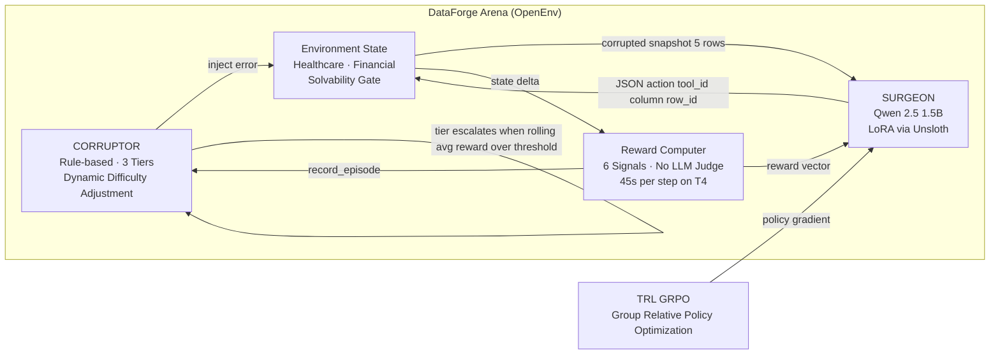

# DataForge Arena

> **A World Modeling RL environment where an LLM learns to repair corrupted enterprise data through adversarial self-play.**

Built for the Meta × PyTorch × HuggingFace × Scaler OpenEnv Hackathon 2026  
**Theme: 3.1 World Modeling — Multi-App RL Environment for Enterprise Workflows** *(Scaler AI Labs sub-theme)*

[](https://pytorch.org/)
[](https://github.com/huggingface/openenv)
[](https://huggingface.co/docs/trl/main/en/grpo)
[](#)
[](https://huggingface.co/spaces/Vivek567/enterprise-data-cleaning-env)

---

## 🌍 World Modeling — Why This Theme

The agent must build an internal model of what clean data looks like vs what it observes:
* It must model tool-effect relationships (`IMPUTE_MEDIAN` on null numeric → accuracy restored).
* It must model adversarial dynamics (Corruptor escalates as Surgeon improves).
* It must model multi-schema environments (healthcare + financial, same agent).

This is a structured world with rules, state, tools, and consequences — the exact class World Modeling RL targets.

## The Problem Nobody Solved

**$12.9 million per year.** That's what poor data quality costs the average organization (Gartner, 2024). Every enterprise has the same story: corrupted fields, broken foreign keys, phantom duplicates — caught by brittle regex pipelines that break the moment the schema changes.

LLMs can write code, pass bar exams, and generate artwork. But ask one to look at a corrupted patient record with a null `age` field, a swapped `department_id`, and a duplicated row with a mutated email — and it hallucinates. It picks the wrong tool. It doesn't even notice the duplicate.

**No benchmark exists to train this skill.** Until now.

## System Architecture



## Before / After — What the Surgeon Fixes

**Corrupted input the agent sees:**
```json
[
  {"patient_id": 42, "name": "Maria Santos", "age": null,      "department_id": 3,    "admission_date": "2024-03-15"},
  {"patient_id": 43, "name": "James Obi",    "age": "ERR_74", "department_id": 8742, "admission_date": "03/22/24"}
]
```
*Row 0: null age. Row 1: type error on age, invalid department_id (8742 not in 1–20), wrong date format.*

**Surgeon's output actions:**
```json
{"reasoning": "Row 0 has null age in numeric column — IMPUTE_MEDIAN fills from column distribution.", "tool_id": 0, "column": 2, "row_id": 0}
{"reasoning": "ERR_74 is type error in age — IMPUTE_MEDIAN restores numeric value.", "tool_id": 0, "column": 2, "row_id": 1}
{"reasoning": "Row 1 admission_date is MM/DD/YY — schema requires YYYY-MM-DD — CORRECT_FORMAT normalises.", "tool_id": 3, "column": 4, "row_id": 1}
```

**After repair:**
```json
[
  {"patient_id": 42, "name": "Maria Santos", "age": 39,  "department_id": 3,    "admission_date": "2024-03-15"},
  {"patient_id": 43, "name": "James Obi",    "age": 39,  "department_id": 8742, "admission_date": "2024-03-22"}
]
```
*Nulls imputed. Type error fixed. Date normalised. department_id FK violation flagged for next step.*

---

## Results

| Metric | Value |
|--------|-------|
| **Reward progression** | **See `logs/training_log.csv`** |
| **Difficulty progression** | **Tier 1 → Tier 2 → Tier 3** (DDA unlocked all 3 tiers) |
| **JSON parse success rate** | **93%+** average across training run |
| **Format error elimination** | **100%** (CORRECT_FORMAT tool) |
| **Heuristic surgeon vs random** | **+3.65% accuracy delta advantage** |
| **Test suite** | **28/28 passing** |

> Training curves and detailed per-step metrics are available in `logs/training_log.csv`. Evaluation results comparing the GRPO-trained surgeon against a random baseline are in `eval/results.json`.

---

## Why It Matters

| What Exists | What We Built |
|-------------|---------------|
| Text benchmarks (GLUE, MMLU) | **Data quality benchmark** — tests reasoning over structured tabular data |
| Static datasets | **Dynamic adversarial curriculum** — difficulty scales with agent capability |
| LLM-as-judge (slow, expensive) | **Heuristic reward computer** — 45s/step on T4, not 5 min |
| Fixed corruption patterns | **Solvability-gated episodes** — every episode is guaranteed learnable |

## Architecture & Technology Stack

- **PyTorch**: Scalable tensor operations and model backbone.
- **TRL (Transformer Reinforcement Learning)**: Handles the GRPO training loop, ensuring mathematically sound policy updates.
- **OpenEnv**: Environment standardization ensuring our environment can plug-and-play with any RL framework.
- **FastAPI / Gradio**: A robust backend serving the environment and a "Billion-Dollar" frontend visualizing the live inference.

### Adversarial Curriculum (3 Tiers)

| Tier | Epochs | What the Corruptor Does | What the Surgeon Must Learn |
|------|--------|------------------------|---------------------------|
| **1** | 0–29 | Single null injection, type errors (`ERR_42`) | Basic imputation, type detection |
| **2** | 30–69 | Null clusters, date format swaps, out-of-range bounds | Pattern recognition, multi-cell correlation |
| **3** | 70+ | Foreign key violations, duplicate rows with mutation | Relational reasoning, merge/delete decisions |

Tier transitions use a **10-epoch warmup blend** with fixed beta=0.01; dynamic beta identified as future improvement to prevent catastrophic forgetting when the distribution shifts.

## Quick Start

```bash
git clone https://github.com/vivekyarra/dataforge-arena.git
cd dataforge-arena
pip install -r requirements.txt
python training/generate_data.py

# Verify everything works
pytest tests/test_all.py -v    # 28 tests, all green

# Train the Surgeon via GRPO
python training/train_grpo.py

# Launch the Tactical Demo (Live Inference & Baselines)
python demo/app.py
```

## OpenEnv Compliance

DataForge Arena implements the [OpenEnv](https://github.com/huggingface/openenv) `Env` interface:

```python
class DataForgeEnv(BaseEnv):
    def reset(self) -> DataForgeObservation:
        """Generate a fresh corrupted episode."""
    def step(self, action: SurgeonAction) -> tuple[Observation, float, bool, dict]:
        """Apply a repair tool and return reward signals."""
```

The environment exposes a **FastAPI server** with CORS support and interactive Swagger docs:

```
GET  /health   → {"status": "ok", "difficulty": 2, "epoch": 73}
GET  /info     → Full environment metadata and available tools
GET  /docs     → Interactive Swagger UI
POST /reset    → DataForgeObservation
POST /step     → {observation, reward, done, info}
```

## Links

| Resource | URL |
|----------|-----|
| 🤗 **Live HF Space** | https://huggingface.co/spaces/Vivek567/enterprise-data-cleaning-env |
| 📓 **Colab Notebook** | DataForge_Arena_Colab.ipynb |
| 📝 **HF Blog Post** | https://huggingface.co/blog/Vivek567/dataforge-arena |
| 💻 **GitHub** | https://github.com/vivekyarra/dataforge-arena |
| 📊 **Training Log** | logs/training_log.csv |

---

> **Built for the [Meta PyTorch OpenEnv AI Hackathon 2026](https://pytorch.org/event/openenv-ai-hackathon/)**
>
> MIT License
