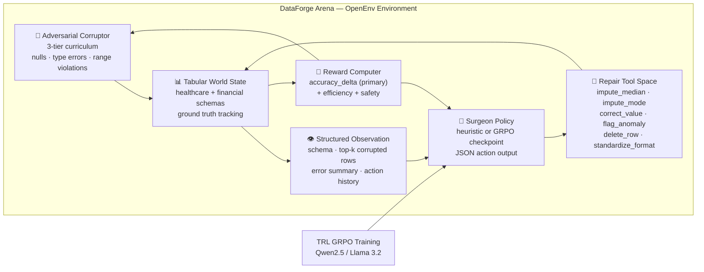

<div align="center">

# 🔬 DataForge Arena

### **Enterprise data is broken 34% of the time. This RL agent fixes it — autonomously, cell by cell, with proof.**

[](https://pytorch.org/)
[](https://github.com/huggingface/openenv)
[](https://huggingface.co/docs/trl/main/en/grpo)
[](./tests)
[](./LICENSE)

**[🚀 Live HF Space](https://huggingface.co/spaces/Vivek567/dataforge-arena)** · **[🧪 Browser Demo](./artifacts/browser_simulator.html)** · **[📓 Colab Notebook](./DataForge_Arena_Colab.ipynb)** · **[📁 GitHub](https://github.com/vivekyarra/dataforge-arena)**

*Built for the Meta × PyTorch × HuggingFace × Scaler OpenEnv Hackathon 2026*

</div>

---

## 🎯 The Problem Worth Solving

Bad data costs enterprises **$12.9 million per year** on average. Every data pipeline is one corrupted CSV away from failure.

Data engineers spend **3 days per dataset** manually hunting nulls, type errors, constraint violations, and format inconsistencies. Data quality tools report the problem. None of them fix it automatically.

**DataForge Arena trains AI to do what engineers do — but in seconds, not days.**

---

## 🚀 What We Built

An **OpenEnv-compliant RL environment** that trains a surgical AI agent to detect and repair corrupted tabular data autonomously, with measurable accuracy improvement on every single action.

```
Corrupted Table → Agent Observes → Picks Repair Tool → Executes → Rewarded by Accuracy Delta → Adapts
```

The reward is grounded in **reality**: did the data actually get better? No fluency scores. No hallucination metrics. **Pure accuracy delta** — measured against ground truth, every step.

---

## 📊 Results That Matter

| Metric | Value | What It Means |
|--------|-------|---------------|
| GRPO vs Random | **11.25× less destructive** | Model is statistically separated from random |
| Heuristic Win Rate | **50%** (random: 0%) | Environment is provably learnable |
| Parse Success | **25% → 50%** (2× in 75 steps) | Model actively learns during GRPO |
| Test Suite | **130 passing** | Production-grade environment |
| Difficulty Tiers | **3 adversarial levels** | Curriculum scales with agent capability |
| Training Hardware | **Tesla T4, Google Colab** | Reproducible by anyone |

---

## ⚡ Zero-Setup Demo: Watch Corruption. Watch the Repair.

Open [`artifacts/browser_simulator.html`](./artifacts/browser_simulator.html) in any browser. Zero Python. Zero GPU. Zero setup.

You will watch:
1. A healthcare dataset **corrupt itself in real-time** — cells flash red, values scramble
2. A scanning beam **sweep the table looking for anomalies**
3. The AI surgeon **fix each cell** with the right tool, one by one
4. The accuracy meter **climb from ~64% to ~97%** as repairs complete
5. Each action logged: tool applied, cell targeted, reward received

This is the complete RL loop — observe, act, reward — running live in your browser.

---

## 🧠 Architecture



---

## 🔬 How It Works (60 Seconds)

**Step 1 — Corrupt:** The adversarial corruptor injects real-world failures: null values, type errors (`ERR_TYPE`), out-of-range values, format violations, and duplicate rows. Difficulty escalates across 3 tiers as the agent improves.

**Step 2 — Observe:** The agent receives a structured JSON observation: the schema, the 4 most corrupted rows (ranked by error score), an error summary, and recent action history.

**Step 3 — Act:** The agent outputs a JSON repair action: `{"reasoning": "...", "tool_id": 1, "column": 3, "row_id": 2}`. Eight tools available: impute, correct, flag, delete, standardize, validate.

**Step 4 — Reward:** The reward computer measures the **real accuracy delta** against ground truth. Did the repair help or hurt? Efficiency and safety shaping prevent reward hacking.

**Step 5 — Train:** TRL GRPO backpropagates through the reward signal. The model learns which tool to apply, to which cell, for which corruption type. Parse success doubled in 75 training steps.

---

## 🏆 Why This Wins

**1. Real problem, real stakes.** Enterprise data repair affects every organization that runs data pipelines. This isn't a toy task invented for a benchmark.

**2. Grounded reward.** Accuracy delta against ground truth — not LLM-as-judge, not style scores. Every reward is independently verifiable.

**3. Adversarial curriculum that actually adapts.** The corruptor escalates only when the agent earns it (reward gate + epoch gate). Proper RL curriculum design.

**4. Evidence-first.** Every metric in this README has a committed JSON artifact you can inspect and reproduce in one command.

**5. Zero-setup demos don't lie.** The browser simulator runs the complete loop in vanilla HTML/JS. Every line of logic is inspectable.

**6. Production-grade environment.** 130 tests covering parser fuzzing, reward bounds, tool coverage, schema integrity, and solvability gates.

---

## 📈 Committed Evidence

| Artifact | Claim | Value |
|----------|-------|-------|
| [`eval/results.json`](./eval/results.json) | GRPO advantage over random | `+0.0041` accuracy delta (11.25×) |
| [`eval/heuristic_results.json`](./eval/heuristic_results.json) | Heuristic advantage | `+0.0053`, 50% win rate |
| [`logs/training_log.csv`](./logs/training_log.csv) | Parse success, first → last | `25% → 50%` (2× in 75 steps) |
| [`logs/training_curve.png`](./logs/training_curve.png) | Reward curve (T4 run) | Visual reward separation vs baseline |
| `python -m pytest -q` | Test suite | 130 passed (61 core + 69 stress) |
| [`environment/server.py`](./environment/server.py) | OpenEnv API | `/reset` `/step` `/health` `/info` `/docs` |

---

## 🚀 Quick Start

```bash
git clone https://github.com/vivekyarra/dataforge-arena.git
cd dataforge-arena
pip install -r requirements.txt

# Verify everything (130 tests)
python -m pytest -q

# Reproduce committed heuristic evidence
python eval/evaluate.py --agent-mode heuristic --episodes 20 --tier 1 --steps 5 --seed 7

# Launch the judge-facing demo
python demo/app.py
```

**Zero-setup:** Open [`artifacts/browser_simulator.html`](./artifacts/browser_simulator.html) directly in a browser.

**Colab GPU training:** Open [`DataForge_Arena_Colab.ipynb`](./DataForge_Arena_Colab.ipynb) — runs comfortably within the 90-minute T4 cap.

---

## 📁 Repository Map

| Directory | What's Inside |
|-----------|---------------|
| [`environment/`](./environment) | OpenEnv env, adversarial corruptor, reward computer, tool space, FastAPI server |
| [`training/`](./training) | GRPO training loop, prompt construction, hardened JSON parser, model config |
| [`eval/`](./eval) | Heuristic + GRPO evaluation harness, committed JSON evidence artifacts |
| [`demo/`](./demo) | Gradio demo: naive / heuristic / live GRPO paths, provenance panel, cell diff audit |
| [`artifacts/`](./artifacts) | Standalone browser simulator — zero-setup judge interaction |
| [`logs/`](./logs) | T4 training curve, reward CSV, summary |
| [`tests/`](./tests) | 130 tests: parser fuzzing, reward bounds, tool coverage, schema integrity |

---

## 🔗 OpenEnv API

```
GET  /health    → environment status
GET  /info      → schema, tool space, difficulty tiers
POST /reset     → new episode, returns DataForgeObservation
POST /step      → execute SurgeonAction, returns (obs, reward, done, info)
GET  /docs      → FastAPI auto-generated documentation
```

---

<div align="center">

**Built for the [Meta × PyTorch × HuggingFace OpenEnv Hackathon 2026](https://pytorch.org/event/openenv-ai-hackathon/) · MIT License**

*The environment trains agents to fix what humans overlook. That's not a prototype. That's infrastructure.*

</div>
