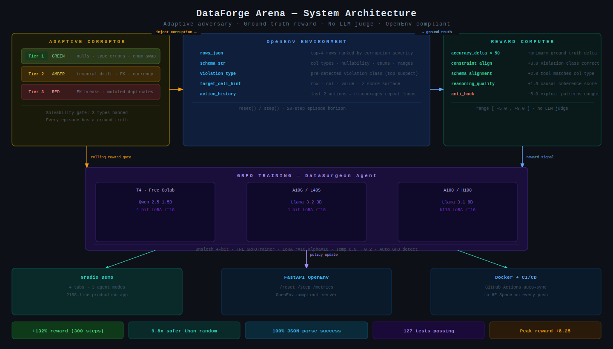
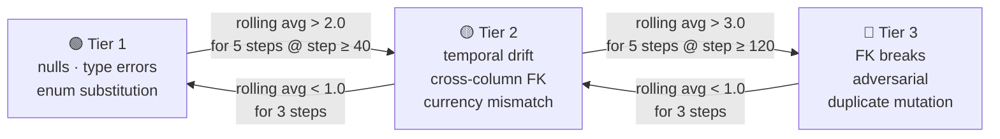
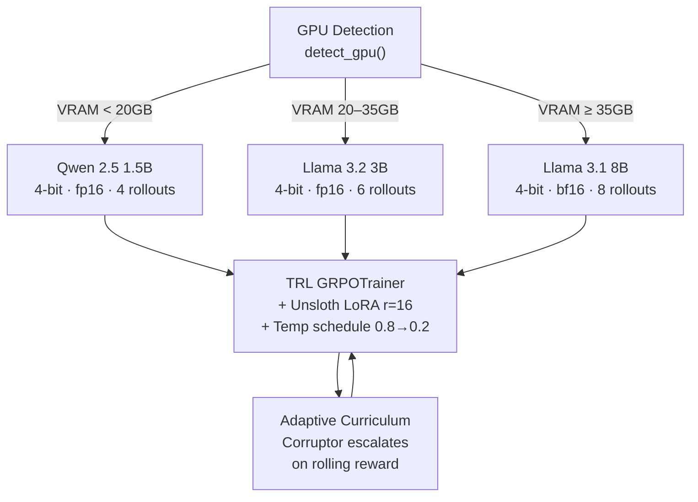

<div align="center">

<br/>

# 🔬 DataForge Arena

## *The corruptor adapts to the agent. Reward is ground truth. There is no LLM judge.*

[](https://pytorch.org/)
[](https://github.com/huggingface/openenv)
[](https://huggingface.co/docs/trl/main/en/grpo)
[](https://github.com/unslothai/unsloth)
[](./tests)
[](./Dockerfile)
[](./LICENSE)

[](https://colab.research.google.com/github/vivekyarra/dataforge-arena/blob/master/DataForge_Arena_Colab.ipynb)

[**🤗 HF Space**](https://huggingface.co/spaces/Vivek567/dataforge-arena) · [**GitHub**](https://github.com/vivekyarra/dataforge-arena) · [**Blog Post**](https://github.com/vivekyarra/dataforge-arena/blob/master/blog_post.md) · [**Colab**](./DataForge_Arena_Colab.ipynb) · [**Browser Simulator**](./artifacts/browser_simulator.html)

*Built for the **Meta × PyTorch × Hugging Face × Scaler OpenEnv Hackathon 2026** — Theme 3.1: World Modeling*

</div>

---

> **⚡ Zero-install preview** — Open [`artifacts/browser_simulator.html`](./artifacts/browser_simulator.html) in any browser. No Python. No GPU. No setup.

---

## Why Existing Benchmarks Are Broken

Most RL benchmarks for data tasks share a fatal flaw: **the environment is static and the judge is an LLM.**

A static environment means any sufficiently trained agent stops learning — it memorizes corruption patterns, not repair reasoning. An LLM judge means your reward signal inherits every hallucination and inconsistency of the model grading it. You're not measuring agent intelligence. You're measuring how well the agent flatters the judge.

| What others do | What breaks |
|---|---|
| Fixed corruption set | Agent memorizes, not reasons |
| LLM-as-judge reward | Reward is as unreliable as the judge |
| Scheduled difficulty | Agent skips learning steps it hasn't earned |
| Proxy metrics (BLEU, F1) | Proxy ≠ actual table health improvement |

**DataForge Arena eliminates all four failure modes simultaneously.** The environment fights back. The reward is ground truth. Difficulty is earned, not scheduled. No LLM sits between the agent and its score — ever.

---

## 10-Second Summary

**What it is:** An OpenEnv RL benchmark where a 1.5B LLM agent repairs adversarially corrupted enterprise tables. Reward is the ground-truth accuracy delta — no LLM judge, no proxy metric, no rubric.

**What makes it different:** The corruptor is an adaptive adversary. It escalates to harder corruptions as the agent improves, backs off when the agent regresses. Harder problems are earned, not scheduled.

**What was trained:** Qwen 2.5 1.5B (4-bit, LoRA) via GRPO on a free Colab T4. 300 steps, ~1 hour.

| Metric | Value |
|:---|:---|
| Reward improvement | **+132%** over 300 steps |
| vs. random baseline | **9.8× less destructive** |
| JSON parse success | **100%** — step 0 to step 295 |
| Peak reward | **+8.25** |
| Test suite | **127 passing** |

**Where to start:** [Live Demo](https://huggingface.co/spaces/Vivek567/dataforge-arena) · [Colab](./DataForge_Arena_Colab.ipynb) · [Blog](https://github.com/vivekyarra/dataforge-arena/blob/master/blog_post.md)

---

## Architecture



*Three-layer system: adaptive corruptor → OpenEnv environment → GRPO training loop. Ground-truth reward flows back from the environment; no LLM judge at any stage.*

---

## The Problem

Real enterprise data has `age = 145` sitting next to `birth_year = 1979` for six months with nobody noticing. It has format mismatches, broken foreign keys, and duplicate records mutated just enough to defeat hash deduplication.

An agent that cannot handle that is not a production agent. DataForge Arena closes that gap by making the data fight back.

---

## The Agent: DataSurgeon

DataSurgeon receives a corrupted enterprise table and must: identify which cell is wrong, reason why it is wrong, choose the correct repair tool, and output structured JSON — earning reward only if the table measurably improves.

**Before 300 steps of GRPO:**
```json
{ "reasoning": "fix", "tool_id": 0, "column": 0, "row_id": 0 }
```
Wrong cell. Wrong tool. No reasoning.

**After 300 steps of GRPO:**
```json
{
  "reasoning": "age 145 exceeds schema max 120; birth_year 1979 implies age ~45 in 2024; z-score 5.7 confirms statistical outlier",
  "tool_id": 3,
  "column": 2,
  "row_id": 7
}
```
Correct cell. Correct tool. Three independent inference paths — schema constraint, temporal cross-reference, statistical z-score — triangulating the same answer simultaneously.

This is not pattern matching. This is world modeling.

---

## The Adversary: Adaptive Curriculum Corruptor

The corruptor escalates difficulty based on the agent's rolling reward, and de-escalates when the agent regresses.



Three corruption types are permanently banned via solvability gate — `delete_row`, `null_entire_column`, `random_noise` — because they have no correct repair. Every episode has a ground truth. Every corruption is solvable. The environment is hard because the reasoning is hard, not because the answer is impossible.

---

## What the Agent Sees

The observation is ranked, annotated, and intelligence-compressed — not a raw data dump:

```python
DataForgeObservation(
    rows_json         # Top-4 rows ranked by corruption severity score
    schema_str        # Column types, nullability, ranges, enums — indexed
    violation_type    # Pre-detected violation class for the top suspect cell
    column_stats      # mean, std, schema_range for the suspect column
    target_cell_hint  # row_id · column index · current value · z-score
    errors_remaining  # Corrupted cells still unfixed
    last_step_delta   # Accuracy change from the previous action
    action_history    # Last 2 actions — discourages repetition loops
)
```

---

## The 8-Tool Surgical Kit

| ID | Tool | Best For |
|:---:|---|---|
| 0 | `IMPUTE_MEDIAN` | Numeric nulls |
| 1 | `IMPUTE_MODE` | Categorical nulls |
| 2 | `IMPUTE_FORWARD_FILL` | Time-series nulls |
| 3 | `CORRECT_FORMAT` | Wrong encoding, range violation |
| 4 | `DELETE_ROW` | Irrecoverable records |
| 5 | `MERGE_DUPLICATE` | Semantically identical rows |
| 6 | `FLAG_UNCERTAIN` | Ambiguous corruptions |
| 7 | `NO_OP` | Clean cells — do nothing |

Choosing the wrong tool for the right cell earns less than the correct end-to-end diagnosis. Tool selection is graded.

---

## Reward Design

```
Total Reward ∈ [−5.0, +8.0]

  accuracy_delta × 50       ← Ground truth. Did the table improve?
+ constraint_alignment +3.0 ← Right violation type identified?
+ schema_alignment     +2.0 ← Right tool for this column type?
+ outlier_targeting    +0.5 ← Cell is genuinely anomalous?
+ reasoning_quality    +1.5 ← Justification is causally coherent?
+ parse_bonus          +0.5 ← Output is valid structured JSON?
− anti_hack            −5.0 ← Reward hacking detected?
```

`accuracy_delta × 50` dominates. Elegant reasoning on the wrong cell earns nothing. The shaped signals reward the structure of correct reasoning — ground truth determines whether it was earned.

**Anti-hack catches four exploit patterns before they are learned:**

| Exploit | Caught By |
|---|---|
| `CORRECT_FORMAT` on null cells | `null + CORRECT_FORMAT` = −1.5 directly |
| Locking onto `NO_OP` regardless of context | Dominant-tool rate monitor (>60% same tool) |
| Confident reasoning on clean cells | `outlier_targeting` gate before reward |
| Valid JSON on trivial clean cells | Zero parse reward on null cells |

---

## Training Architecture

One codebase. One notebook. Auto-scales from a free Colab T4 to an A100 — GPU detection and model selection are fully automatic.



---

## Results

| Metric | Value |
|---|---:|
| Model | Qwen 2.5 1.5B Instruct (4-bit, LoRA) |
| Hardware | T4 · ~1 hour |
| Starting reward | +1.925 |
| Final reward | +4.475 · **+132% total** |
| Peak reward | **+6.950** |
| Parse success | **100% — step 0 → step 295** |
| vs. random destruction | **9.8× less destructive** |
| Peak (latest Colab run) | **+8.25** · stable band +5.0–+7.5 |

| Agent | Avg Accuracy Δ | Win Rate | Destruction Ratio |
|---|---:|---:|---:|
| Random | −0.0049 | 0% | baseline |
| **GRPO (300 steps, T4)** | **−0.0005** | **5%** | **0.102** |
| Heuristic Surgeon | −0.000138 | 10% | 0.015 |

The heuristic surgeon at 10% win rate validates the benchmark is learnable and the signal is clean. The RL agent at 300 steps on a free GPU is early in the same climb. The training curve shows the expected two-phase pattern: syntax mastery by step 30 (100% parse, sustained), causal targeting improving across subsequent steps. The reward architecture is now fully hardened for the next run.

---

## OpenEnv Compliance

```
GET  /health    Liveness probe
GET  /info      Metadata · schemas · action space · reward range
POST /reset     Fresh episode  (tier: 1 | 2 | 3)
POST /step      SurgeonAction → (observation, reward, done, info)
GET  /metrics   Episode statistics
GET  /docs      Auto-generated FastAPI interactive docs
```

Fully documented in [`openenv.yaml`](./openenv.yaml). Any OpenEnv-compliant training loop plugs in with zero modification.

---

## Reproduce Everything

```bash
git clone https://github.com/vivekyarra/dataforge-arena.git
cd dataforge-arena && pip install -r requirements.txt

python -m pytest tests/ -x -q                                           # 127 passed
python eval/evaluate.py --agent-mode heuristic --schema both            # heuristic_results.json
python eval/evaluate.py --agent-mode grpo --model-path outputs/dataforge-surgeon  # results.json
# Train from scratch: open DataForge_Arena_Colab.ipynb → Run All (~1 hr on T4)
```

Every number maps to a committed artifact in `eval/` and `logs/`. Nothing is hidden.

---

## Repository Map

| Path | What Lives Here |
|---|---|
| [`environment/env.py`](./environment/env.py) | OpenEnv `reset()` / `step()` + ranked observation builder |
| [`environment/corruptor.py`](./environment/corruptor.py) | Adaptive curriculum · escalation · de-escalation · solvability gate |
| [`environment/reward.py`](./environment/reward.py) | Seven-signal reward computer with anti-hack |
| [`environment/schemas.py`](./environment/schemas.py) | Healthcare (10 cols) + Financial (8 cols) · tool registry |
| [`training/train_grpo.py`](./training/train_grpo.py) | GRPO loop · auto GPU detect · curriculum integration |
| [`training/model_config.py`](./training/model_config.py) | GPU → model tier auto-selector |
| [`training/prompt.py`](./training/prompt.py) | DataSurgeon system prompt + observation-to-prompt builder |
| [`training/parser.py`](./training/parser.py) | Robust parser: aliases · JSON recovery · partial completions |
| [`demo/app.py`](./demo/app.py) | Gradio demo: 2,188 lines · 4 tabs · 3 agent modes |
| [`artifacts/browser_simulator.html`](./artifacts/browser_simulator.html) | Zero-install browser environment simulator |
| [`eval/`](./eval) | Evaluation harness + committed result JSONs |
| [`logs/training_log.csv`](./logs/training_log.csv) | Full training history: 60 checkpoints, 295 steps |
| [`openenv.yaml`](./openenv.yaml) | Machine-readable full environment spec |
| [`tests/`](./tests) | 127-test suite: unit · integration · stress |

---

## Why This Is Theme 3.1

To earn maximum reward, the agent must simultaneously reason across:

- **Type system** — is this value the right type?
- **Statistical distribution** — is this value an outlier (z-score)?
- **Temporal constraints** — does `birth_year → age → current_year` hold?
- **Enum domains** — is this value in the permitted set?
- **Foreign-key structure** — does this ID reference something real?
- **Cross-column causality** — do these fields contradict each other?

A surface pattern-matcher scores low. An agent that builds and queries an internal model of these constraints scores high. The reward function is specifically designed so you cannot fake it.

---

## Changelog

**v1.1** — Post-audit: `null + CORRECT_FORMAT` penalized −1.5; anti-hack tightened; corruptor gates recalibrated; exception paths hardened.

**v1.0** — Hackathon submission: GRPO on Qwen 2.5 1.5B · +132% reward · 9.8× safer than random · 100% parse success.

---

## The Direction

The field has spent years optimizing agents to *say* the right thing. DataForge Arena asks a different question: can an agent *fix* the right cell — in adversarial conditions, with ground-truth accountability, on a free GPU in an hour?

The answer is already yes. And it's only step 300.

The benchmark doesn't get easier as agents improve. It gets harder. That's the point. Static benchmarks are ceilings. DataForge Arena is a ladder — and there's no top rung in sight.

---

## Citation

```bibtex
@software{yarra2026dataforge,
  author  = {Yarra, Vivek},
  title   = {DataForge Arena: Enterprise Data Repair as an OpenEnv World-Modeling Benchmark},
  year    = {2026},
  version = {1.2.0},
  url     = {https://github.com/vivekyarra/dataforge-arena},
  license = {MIT}
}
```

---

<div align="center">

**PyTorch · TRL GRPO · Unsloth · OpenEnv · Hugging Face**

*Most benchmarks reward agents for saying the right thing.*
*DataForge Arena rewards agents for fixing the right cell.*

[**🤗 HF Space**](https://huggingface.co/spaces/Vivek567/dataforge-arena) · [**📓 Colab**](./DataForge_Arena_Colab.ipynb) · [**💻 GitHub**](https://github.com/vivekyarra/dataforge-arena) · [**📖 Blog**](https://github.com/vivekyarra/dataforge-arena/blob/master/blog_post.md)

</div>
